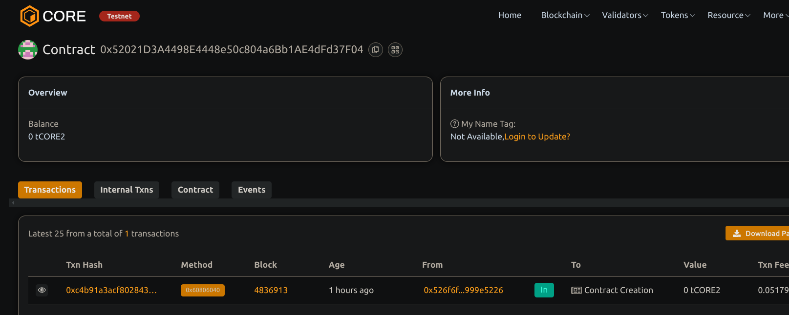

# Digital Voting System

## Project Title
Digital Voting System with Transparent Ballot Counting

## Project Description
This project implements a decentralized digital voting system on the Ethereum blockchain using Solidity. The system provides a transparenter-proof platform for conducting elections or polls with fully auditable results. Every vote cast is permanently recorded on the blockchain, ensuring transparency throughout the entire process while maintaining voter privacy.

The smart contract manages the full lifecycle of a voting event - from registration of eligible voters to the final counting of ballots. All vote counts are publicly accessible and automatically tallied, eliminating the need for manual counting and reducing the risk of manipulation.

## Project Vision
The vision for this Digital Voting System is to revolutionize traditional voting processes by leveraging blockchain technology to create a more transparent, secure, and accessible democratic tool. By removing centralized control and implementing cryptographic security, we aim to restore trust in voting systems and increase participation in democratic processes.

This system addresses key challenges in traditional voting methodologies: ballot tampering, voter fraud, lack of transparency, and limited accessibility. Our blockchain-based approach provides an immutable record of votes that anyone can verify, while still protecting voter privacy.

## Key Features
- **Transparent Ballot Counting**: All votes are counted automatically and results are publicly available on the blockchain
- **Secure Voter Registration**: Only authorized addresses can participate in voting
- **Time-bounded Voting Periods**: Voting is only allowed during a predefined period
- **Single Vote Enforcement**: The system prevents double-voting
- **Real-time Results**: Vote counts are updated instantly as votes are cast
- **Chairperson Control**: A designated chairperson manages voter registration and can end the voting period
- **Multiple Proposals**: Support for multiple voting options with descriptions
- **Event Logging**: All significant actions emit events for off-chain monitoring
- **Public Verification**: Anyone can verify the vote count without requiring special access

## Future Scope
- **Secret Ballot Implementation**: Enhance privacy through zero-knowledge proofs or other cryptographic methods
- **Delegated Voting**: Allow voters to delegate their vote to trusted representatives
- **Weighted Voting**: Implement a system where votes carry different weights based on predefined criteria
- **Multi-round Elections**: Support for runoff elections or multiple voting rounds
- **Voter Identity Verification**: Integration with decentralized identity solutions for secure voter authentication
- **Quadratic Voting**: Implementation of quadratic voting mechanisms for more nuanced preference expression
- **Mobile Application**: Development of a user-friendly mobile interface for participating in votes
- **Cross-chain Compatibility**: Enable voting across multiple blockchain networks
- **Automated Execution**: Trigger automatic actions based on voting results
- **Governance Integration**: Seamless integration with DAO governance structures

## Contract details
0x52021D3A4498E4448e50c804a6Bb1AE4dFd37F04

